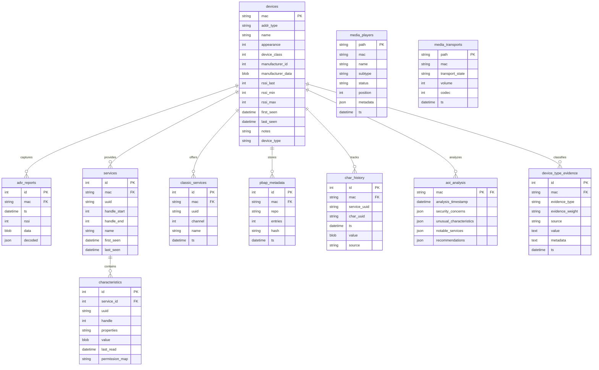

# Bleep Observation Database Schema

This document provides a comprehensive reference for the Bleep observation database schema, explaining the tables, relationships, and usage patterns.

## Overview

The observation database is a SQLite database located at `~/.bleep/observations.db`. It stores information about discovered Bluetooth devices, their services, characteristics, and various other data points collected during scanning and enumeration operations.

## Schema Version History

| Version | Added Features | Migration Notes |
|---------|---------------|-----------------|
| 1 | Initial schema with devices, services, characteristics tables | |
| 2 | Renamed problematic column names to avoid Python keyword conflicts:<br>- `class` → `device_class` in devices table<br>- `state` → `transport_state` in media_transports table | Backward compatibility maintained |
| 3 | Added `device_type` field for improved device classification:<br>- Values: 'unknown', 'classic', 'le', or 'dual' | Basic classification added |
| 4 | Added `aoi_analysis` table for storing Assets of Interest analysis results | |
| 5 | Added performance indexes for frequently queried fields | Indexes on device_type, last_seen, adv_reports, char_history |
| 6 | Added `device_type_evidence` table for classification audit trail and signature caching | Evidence-based classification system, stateless classification |

## Database Relationship Diagram



The diagram shows the primary relationships between tables in the observation database:

1. A **device** (identified by MAC address) can have:
   - Multiple advertising reports (`adv_reports`)
   - Multiple GATT services (`services`)
   - Multiple Classic Bluetooth services (`classic_services`)
   - Multiple phonebook repositories (`pbap_metadata`)
   - Multiple characteristic value changes tracked over time (`char_history`)
   - One security analysis result (`aoi_analysis`)

2. Each **service** can contain multiple characteristics.

3. Media players and transports are loosely coupled to devices (no enforced foreign key).

## Tables and Relationships

### devices

Primary table for storing discovered Bluetooth devices.

| Column | Type | Description |
|--------|------|-------------|
| mac | TEXT PRIMARY KEY | Device MAC address (normalized to lowercase) |
| addr_type | TEXT | Address type ('public', 'random', etc.) |
| name | TEXT | Device name or alias |
| appearance | INT | Bluetooth appearance value |
| device_class | INT | Bluetooth device class (renamed from 'class') |
| manufacturer_id | INT | Manufacturer ID from advertising data |
| manufacturer_data | BLOB | Raw manufacturer-specific data |
| rssi_last | INT | Most recent RSSI value |
| rssi_min | INT | Minimum recorded RSSI value |
| rssi_max | INT | Maximum recorded RSSI value |
| first_seen | DATETIME | First discovery timestamp (preserved on updates) |
| last_seen | DATETIME | Most recent discovery timestamp |
| notes | TEXT | User-provided notes |
| device_type | TEXT | Device type: 'unknown', 'classic', 'le', or 'dual' |

### adv_reports

Stores Bluetooth LE advertising reports.

| Column | Type | Description |
|--------|------|-------------|
| id | INTEGER PRIMARY KEY | Auto-incrementing identifier |
| mac | TEXT REFERENCES devices(mac) | Device MAC address (foreign key) |
| ts | DATETIME | Timestamp when advertisement was received |
| rssi | INT | RSSI value for this advertisement |
| data | BLOB | Raw advertising data |
| decoded | JSON | Decoded/parsed advertising data |

### services

Stores service information for GATT-enabled devices.

| Column | Type | Description |
|--------|------|-------------|
| id | INTEGER PRIMARY KEY | Auto-incrementing identifier |
| mac | TEXT REFERENCES devices(mac) | Device MAC address (foreign key) |
| uuid | TEXT | Service UUID |
| handle_start | INT | Starting handle for the service |
| handle_end | INT | Ending handle for the service |
| name | TEXT | Service name (if known) |
| first_seen | DATETIME | First discovery timestamp |
| last_seen | DATETIME | Most recent discovery timestamp |

**Indexes:**
- `idx_services_mac_uuid`: Unique index on (mac, uuid)

### characteristics

Stores characteristic information for GATT services.

| Column | Type | Description |
|--------|------|-------------|
| id | INTEGER PRIMARY KEY | Auto-incrementing identifier |
| service_id | INT REFERENCES services(id) | Associated service (foreign key) |
| uuid | TEXT | Characteristic UUID |
| handle | INT | Characteristic handle |
| properties | TEXT | Comma-separated list of properties (read, write, notify, etc.) |
| value | BLOB | Most recent characteristic value |
| last_read | DATETIME | Timestamp of last successful read |
| permission_map | TEXT | JSON representation of permission/access information |

**Constraints:**
- Unique constraint on (service_id, uuid)

### classic_services

Stores services discovered on Bluetooth Classic devices.

| Column | Type | Description |
|--------|------|-------------|
| id | INTEGER PRIMARY KEY | Auto-incrementing identifier |
| mac | TEXT REFERENCES devices(mac) | Device MAC address (foreign key) |
| uuid | TEXT | Service UUID |
| channel | INT | RFCOMM channel number |
| name | TEXT | Service name (if known) |
| ts | DATETIME | Discovery timestamp |

### char_history

Stores the history of characteristic values for time-series analysis.

| Column | Type | Description |
|--------|------|-------------|
| id | INTEGER PRIMARY KEY | Auto-incrementing identifier |
| mac | TEXT REFERENCES devices(mac) | Device MAC address (foreign key) |
| service_uuid | TEXT | Service UUID |
| char_uuid | TEXT | Characteristic UUID |
| ts | DATETIME | Timestamp of the value |
| value | BLOB | Characteristic value |
| source | TEXT | How the value was obtained ('read', 'write', 'notification', 'unknown') |

### media_players

Stores information about media player capabilities.

| Column | Type | Description |
|--------|------|-------------|
| path | TEXT PRIMARY KEY | D-Bus object path |
| mac | TEXT | Device MAC address |
| name | TEXT | Player name |
| subtype | TEXT | Player subtype |
| status | TEXT | Player status (playing, paused, etc.) |
| position | INT | Current playback position |
| metadata | JSON | Track metadata |
| ts | DATETIME | Timestamp |

### media_transports

Stores information about media transport capabilities.

| Column | Type | Description |
|--------|------|-------------|
| path | TEXT PRIMARY KEY | D-Bus object path |
| mac | TEXT | Device MAC address |
| transport_state | TEXT | Transport state (renamed from 'state') |
| volume | INT | Current volume level |
| codec | INT | Codec identifier |
| ts | DATETIME | Timestamp |

### pbap_metadata

Stores metadata about phonebook access profile repositories.

| Column | Type | Description |
|--------|------|-------------|
| id | INTEGER PRIMARY KEY | Auto-incrementing identifier |
| mac | TEXT REFERENCES devices(mac) | Device MAC address (foreign key) |
| repo | TEXT | Repository name |
| entries | INT | Number of entries |
| hash | TEXT | Hash of the repository contents |
| ts | DATETIME | Timestamp |

### aoi_analysis

Stores Assets of Interest analysis results.

| Column | Type | Description |
|--------|------|-------------|
| mac | TEXT PRIMARY KEY REFERENCES devices(mac) | Device MAC address (foreign key) |
| analysis_timestamp | DATETIME | When the analysis was performed |
| security_concerns | JSON | Identified security concerns |
| unusual_characteristics | JSON | Unusual characteristics identified |
| notable_services | JSON | Notable services identified |
| recommendations | JSON | Security recommendations |

### device_type_evidence

Stores device type classification evidence for audit/debugging and signature caching (Schema v6).

**Important**: This table is for audit trail purposes only. Evidence stored here is **NOT used for classification decisions** - classification is stateless and based only on current device properties.

| Column | Type | Description |
|--------|------|-------------|
| id | INTEGER PRIMARY KEY | Auto-incrementing identifier |
| mac | TEXT REFERENCES devices(mac) ON DELETE CASCADE | Device MAC address (foreign key) |
| evidence_type | TEXT NOT NULL | Type of evidence (e.g., 'classic_device_class', 'le_addr_random') |
| evidence_weight | TEXT NOT NULL | Weight of evidence ('conclusive', 'strong', 'weak', 'inconclusive') |
| source | TEXT NOT NULL | Source of evidence (e.g., 'dbus_property', 'sdp_query', 'gatt_enumeration') |
| value | TEXT | Evidence value (JSON or string representation) |
| metadata | TEXT | Additional context (JSON format) |
| ts | DATETIME NOT NULL | Timestamp when evidence was collected |
| UNIQUE(mac, evidence_type, source) | | Prevents duplicate evidence entries |

**Indexes:**
- `idx_device_type_evidence_mac` on `mac` - Fast lookups by device
- `idx_device_type_evidence_type` on `evidence_type` - Filter by evidence type
- `idx_device_type_evidence_ts` on `ts` - Time-based queries

**Usage:**
- Audit trail: Track what evidence was collected for debugging
- Signature caching: Build device signatures for performance optimization
- Historical tracking: Detect MAC address collisions (same MAC, different evidence over time)

## Device Type Classification Logic

BLEEP uses an **evidence-based, stateless classification system** (Schema v6). Classification decisions are based **only** on current device properties and active queries, never on historical database data. This prevents false positives from MAC address collisions.

### Classification Criteria

1. **'unknown'** - Default value when not enough evidence is available
   - No conclusive evidence from either protocol
   - Insufficient information to make a determination

2. **'classic'** - Requires conclusive Classic evidence:
   - **Conclusive**: `device_class` property present OR SDP records discovered
   - **Strong**: Classic service UUIDs detected (from `SPEC_UUID_NAMES__SERV_CLASS`)
   - Requires at least one conclusive piece of evidence

3. **'le'** - Requires conclusive LE evidence:
   - **Conclusive**: `AddressType` = "random" OR GATT services resolved
   - **Strong**: LE service UUIDs detected (from `SPEC_UUID_NAMES__SERV`)
   - **Note**: `AddressType` = "public" is **inconclusive** (default for both Classic and LE)
   - Requires at least one conclusive piece of evidence OR multiple strong pieces

4. **'dual'** - **Strict requirement**: Conclusive evidence from BOTH protocols:
   - **MUST** have conclusive Classic evidence (device_class OR SDP records)
   - **MUST** have conclusive LE evidence (random address OR GATT services)
   - Both protocols must be confirmed independently
   - Prevents false positives from MAC address collisions

### Evidence Storage

The `device_type_evidence` table stores evidence for audit/debugging purposes:

- **NOT used for classification decisions** (stateless system)
- Tracks what evidence was collected and when
- Enables debugging classification decisions
- Supports signature caching for performance

For detailed information, see [Device Type Classification Guide](device_type_classification.md).

## Query Examples

### Listing Devices by Type

```sql
-- Get all BLE devices (LE-only and dual-mode)
SELECT * FROM devices WHERE device_type = 'le' OR device_type = 'dual';

-- Get all Classic devices (Classic-only and dual-mode)
SELECT * FROM devices WHERE device_type = 'classic' OR device_type = 'dual';

-- Get only dual-mode devices
SELECT * FROM devices WHERE device_type = 'dual';
```

### Querying Device Type Evidence

```sql
-- Get all evidence for a device
SELECT * FROM device_type_evidence
WHERE mac = '00:11:22:33:44:55'
ORDER BY ts DESC;

-- Get evidence by type
SELECT * FROM device_type_evidence
WHERE mac = '00:11:22:33:44:55'
AND evidence_type = 'classic_device_class'
ORDER BY ts DESC;

-- Get classification results
SELECT * FROM device_type_evidence
WHERE mac = '00:11:22:33:44:55'
AND evidence_type = 'classification_result'
ORDER BY ts DESC;

-- Get conclusive evidence only
SELECT * FROM device_type_evidence
WHERE mac = '00:11:22:33:44:55'
AND evidence_weight = 'conclusive'
ORDER BY ts DESC;
```

### Characteristic Timeline with Filtering

```sql
-- Get history for a specific characteristic
SELECT * FROM char_history 
WHERE mac = '00:11:22:33:44:55' 
AND service_uuid = '1800' 
AND char_uuid = '2a00'
ORDER BY ts DESC LIMIT 10;

-- Get all read operations on a device
SELECT * FROM char_history
WHERE mac = '00:11:22:33:44:55'
AND source = 'read'
ORDER BY ts DESC;
```

### Finding Devices by Service

```sql
-- Find all devices with a specific service
SELECT d.* FROM devices d
JOIN services s ON d.mac = s.mac
WHERE s.uuid = '1800'
ORDER BY d.last_seen DESC;
```

## Programmatic API

The observation database can be accessed programmatically through functions provided in the `bleep.core.observations` module:

```python
from bleep.core.observations import get_devices, get_device_detail

# List all BLE devices
ble_devices = get_devices(status='ble')

# Get detailed information for a specific device
device_info = get_device_detail('00:11:22:33:44:55')

# Export complete device data for offline analysis
device_data = export_device_data('00:11:22:33:44:55')
```

For more examples and detailed API documentation, refer to the function docstrings in `bleep/core/observations.py`.
