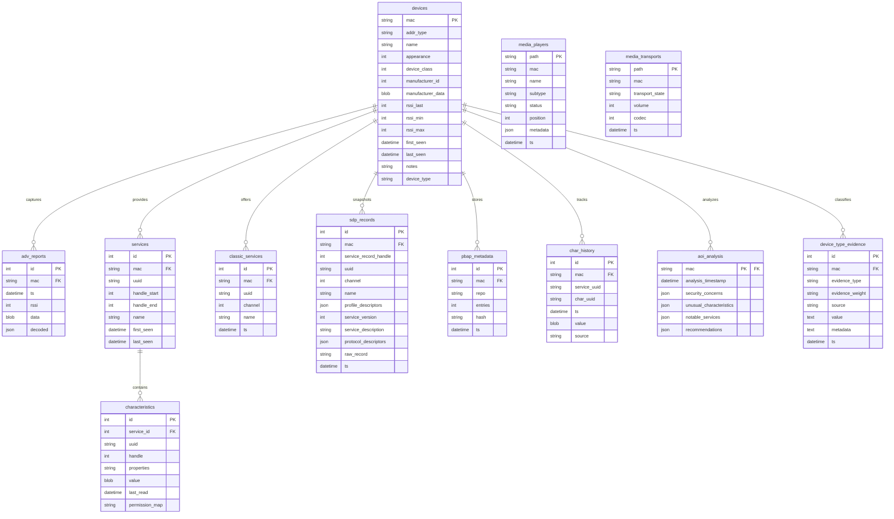

# Bleep Observation Database Schema

This document provides a comprehensive reference for the Bleep observation database schema, explaining the tables, relationships, and usage patterns.

## Overview

The observation database is a SQLite database located at `~/.bleep/observations.db`. It stores information about discovered Bluetooth devices, their services, characteristics, and various other data points collected during scanning and enumeration operations.

## Schema Version History

| Version | Added Features | Migration Notes |
|---------|---------------|-----------------|
| 1 | Initial schema with devices, services, characteristics tables | |
| 2 | Renamed problematic column names to avoid Python keyword conflicts:<br>- `class` → `device_class` in devices table<br>- `state` → `transport_state` in media_transports table | Backward compatibility maintained |
| 3 | Added `device_type` field for improved device classification:<br>- Values: 'unknown', 'classic', 'le', or 'dual' | Basic classification added |
| 4 | Added `aoi_analysis` table for storing Assets of Interest analysis results | |
| 5 | Added performance indexes for frequently queried fields | Indexes on device_type, last_seen, adv_reports, char_history |
| 6 | Added `device_type_evidence` table for classification audit trail and signature caching | Evidence-based classification system, stateless classification |
| 6.1 | **Fix (2025-11-27)**: Corrected database operation sequencing to prevent FOREIGN KEY constraint violations | Device insertion now occurs before classification evidence storage. Modified `adapter.get_discovered_devices()`, `scan._native_scan()`, and `scan._base_enum()` to ensure proper sequencing |
| 7 | Added `sdp_records` table for full SDP record snapshots | Stores complete SDP records with all attributes (Service Record Handle, Profile Descriptors, Service Version, Service Description, raw record) |

## Database Relationship Diagram


```mermaid
erDiagram
    devices {
        string mac PK
        string addr_type
        string name
        int appearance
        int device_class
        int manufacturer_id
        blob manufacturer_data
        int rssi_last
        int rssi_min
        int rssi_max
        datetime first_seen
        datetime last_seen
        string notes
        string device_type
    }
    
    adv_reports {
        int id PK
        string mac FK
        datetime ts
        int rssi
        blob data
        json decoded
    }
    
    services {
        int id PK
        string mac FK
        string uuid
        int handle_start
        int handle_end
        string name
        datetime first_seen
        datetime last_seen
    }
    
    characteristics {
        int id PK
        int service_id FK
        string uuid
        int handle
        string properties
        blob value
        datetime last_read
        string permission_map
    }
    
    classic_services {
        int id PK
        string mac FK
        string uuid
        int channel
        string name
        datetime ts
    }
    
    sdp_records {
        int id PK
        string mac FK
        int service_record_handle
        string uuid
        int channel
        string name
        json profile_descriptors
        int service_version
        string service_description
        json protocol_descriptors
        string raw_record
        datetime ts
    }
    
    pbap_metadata {
        int id PK
        string mac FK
        string repo
        int entries
        string hash
        datetime ts
    }
    
    char_history {
        int id PK
        string mac FK
        string service_uuid
        string char_uuid
        datetime ts
        blob value
        string source
    }
    
    media_players {
        string path PK
        string mac
        string name
        string subtype
        string status
        int position
        json metadata
        datetime ts
    }
    
    media_transports {
        string path PK
        string mac
        string transport_state
        int volume
        int codec
        datetime ts
    }
    
    aoi_analysis {
        string mac PK "FK"
        datetime analysis_timestamp
        json security_concerns
        json unusual_characteristics
        json notable_services
        json recommendations
    }
    
    device_type_evidence {
        int id PK
        string mac FK
        string evidence_type
        string evidence_weight
        string source
        text value
        text metadata
        datetime ts
    }
    
    devices ||--o{ adv_reports : "captures"
    devices ||--o{ services : "provides"
    devices ||--o{ classic_services : "offers"
    devices ||--o{ sdp_records : "snapshots"
    devices ||--o{ pbap_metadata : "stores"
    devices ||--o{ char_history : "tracks"
    devices ||--o{ aoi_analysis : "analyzes"
    devices ||--o{ device_type_evidence : "classifies"
    services ||--o{ characteristics : "contains"
```

The diagram shows the primary relationships between tables in the observation database:

1. A **device** (identified by MAC address) can have:
   - Multiple advertising reports (`adv_reports`)
   - Multiple GATT services (`services`)
   - Multiple Classic Bluetooth services (`classic_services`)
   - Multiple SDP record snapshots (`sdp_records`)
   - Multiple phonebook repositories (`pbap_metadata`)
   - Multiple characteristic value changes tracked over time (`char_history`)
   - One security analysis result (`aoi_analysis`)

2. Each **service** can contain multiple characteristics.

3. Media players and transports are loosely coupled to devices (no enforced foreign key).

## Data Types and Conventions

### SQLite Data Types

The database uses SQLite's type system with the following conventions:

- **TEXT**: String data, stored as UTF-8. MAC addresses are normalized to lowercase (e.g., `'aa:bb:cc:dd:ee:ff'`).
- **INTEGER**: Signed 64-bit integers. Used for handles, RSSI values, device classes, etc.
- **BLOB**: Binary large object. Used for raw advertising data, manufacturer data, and characteristic values. When exported via API, BLOBs are converted to hex strings for JSON serialization.
- **JSON**: Stored as TEXT but validated as JSON. Used for structured data like decoded advertising reports, profile descriptors, and analysis results. SQLite 3.38+ provides JSON functions for querying.
- **DATETIME**: Stored as TEXT in ISO 8601 format (e.g., `'2025-01-15T10:30:45.123456'`). Uses UTC timezone. SQLite's date/time functions can be used for queries.

### Foreign Key Constraints

All foreign key relationships use `ON DELETE CASCADE`, meaning:
- When a device is deleted, all related records (services, characteristics, advertising reports, etc.) are automatically deleted
- This ensures referential integrity and prevents orphaned records

### Indexes

Indexes are created on frequently queried columns to improve query performance:
- Device lookups by type, last seen timestamp
- Service lookups by MAC and UUID
- Characteristic history queries by device, service, characteristic, timestamp, and source
- SDP record queries by MAC, UUID, and timestamp
- Evidence queries by MAC, type, and timestamp

## Tables and Relationships

### devices

Primary table for storing discovered Bluetooth devices. This is the central table that all other tables reference.

**Primary Key:** `mac` (TEXT)

**Foreign Key Relationships:**
- Referenced by: `adv_reports`, `services`, `characteristics` (via services), `classic_services`, `sdp_records`, `pbap_metadata`, `char_history`, `aoi_analysis`, `device_type_evidence`
- All child tables use `ON DELETE CASCADE` to maintain referential integrity

| Column | Type | Constraints | Description |
|--------|------|------------|-------------|
| mac | TEXT | PRIMARY KEY, NOT NULL | Device MAC address, normalized to lowercase (e.g., `'aa:bb:cc:dd:ee:ff'`). Used as the primary identifier for all device-related data. |
| addr_type | TEXT | NULL | Address type for LE devices: `'public'` (default, inconclusive), `'random'` (conclusive LE evidence), or `NULL` (Classic devices). |
| name | TEXT | NULL | Device name or alias as reported by the device or set by the user. May be `NULL` if device doesn't advertise a name. |
| appearance | INT | NULL | Bluetooth appearance value (16-bit) from LE advertising data. Used for device categorization (e.g., phone, watch, keyboard). |
| device_class | INT | NULL | Bluetooth device class (24-bit) from Classic devices. **Conclusive Classic evidence** when present. Format: `0xHHMMLL` (major class, minor class, service class). |
| manufacturer_id | INT | NULL | Company ID from Bluetooth SIG Assigned Numbers. Extracted from advertising data or device properties. |
| manufacturer_data | BLOB | NULL | Raw manufacturer-specific advertising data. Stored as binary for offline analysis. When exported via API, converted to hex string. |
| rssi_last | INT | NULL | Most recent RSSI (Received Signal Strength Indicator) value in dBm. Typically ranges from -100 (weak) to 0 (strong). |
| rssi_min | INT | NULL | Minimum RSSI value recorded for this device. Useful for tracking signal quality over time. |
| rssi_max | INT | NULL | Maximum RSSI value recorded for this device. Useful for tracking signal quality over time. |
| first_seen | DATETIME | NULL | First discovery timestamp in ISO 8601 format (UTC). **Preserved on updates** - this value never changes once set. |
| last_seen | DATETIME | NULL | Most recent discovery timestamp in ISO 8601 format (UTC). **Updated on every device interaction** (scan, connect, etc.). |
| notes | TEXT | NULL | User-provided notes or annotations. Free-form text for custom device labeling or analysis notes. |
| device_type | TEXT | NULL | Device type classification: `'unknown'` (default), `'classic'` (BR/EDR only), `'le'` (BLE only), or `'dual'` (both protocols). Classification is evidence-based and stateless. |

**Indexes:**
- `idx_devices_device_type` on `device_type` - Fast filtering by device type
- `idx_devices_last_seen` on `last_seen` - Time-based queries and "recent devices" filtering

**Usage Notes:**
- MAC addresses are normalized to lowercase for consistency
- `first_seen` and `last_seen` use UTC timestamps
- `device_type` is automatically determined by the classification system based on evidence
- Device records are created automatically during scanning/enumeration operations

### adv_reports

Stores Bluetooth LE advertising reports captured during passive scanning. Each row represents a single advertising packet received from a device.

**Primary Key:** `id` (INTEGER AUTOINCREMENT)

**Foreign Key:** `mac` REFERENCES `devices(mac) ON DELETE CASCADE`

**Indexes:**
- `idx_adv_reports_mac` on `mac` - Fast lookups by device
- `idx_adv_reports_ts` on `ts` - Time-based queries and chronological ordering

| Column | Type | Constraints | Description |
|--------|------|------------|-------------|
| id | INTEGER | PRIMARY KEY, AUTOINCREMENT | Unique identifier for each advertising report. Auto-generated sequential number. |
| mac | TEXT | NOT NULL, REFERENCES devices(mac) ON DELETE CASCADE | Device MAC address (foreign key). Links to the `devices` table. |
| ts | DATETIME | NULL | Timestamp when the advertisement was received, in ISO 8601 format (UTC). |
| rssi | INT | NULL | RSSI value for this specific advertisement in dBm. Can vary between advertisements from the same device. |
| data | BLOB | NULL | Raw advertising data as received from the device. Stored as binary for complete fidelity. When exported via API, converted to hex string. |
| decoded | JSON | NULL | Parsed/decoded advertising data structure. Contains structured fields like service UUIDs, manufacturer data, flags, etc. Format: JSON object with keys like `'flags'`, `'services'`, `'manufacturer_data'`, etc. |

**Usage Notes:**
- Multiple reports can exist for the same device (one per advertising packet)
- `data` contains the raw bytes for complete analysis
- `decoded` provides structured access to common fields
- Reports are automatically inserted during passive scanning operations
- Use time-based queries to track advertising patterns over time

### services

Stores GATT (Generic Attribute Profile) service information for Bluetooth Low Energy devices. Each row represents a service discovered on a device.

**Primary Key:** `id` (INTEGER AUTOINCREMENT)

**Foreign Key:** `mac` REFERENCES `devices(mac) ON DELETE CASCADE`

**Unique Constraint:** `(mac, uuid)` - Ensures one service record per UUID per device

**Indexes:**
- `idx_services_mac_uuid` on `(mac, uuid)` - Unique index for fast lookups and preventing duplicates

| Column | Type | Constraints | Description |
|--------|------|------------|-------------|
| id | INTEGER | PRIMARY KEY, AUTOINCREMENT | Unique identifier for each service record. Used as foreign key by `characteristics` table. |
| mac | TEXT | NOT NULL, REFERENCES devices(mac) ON DELETE CASCADE | Device MAC address (foreign key). Links to the `devices` table. |
| uuid | TEXT | NOT NULL | Service UUID in standard format (e.g., `'1800'` for 16-bit, `'00001800-0000-1000-8000-00805f9b34fb'` for 128-bit). |
| handle_start | INT | NULL | Starting attribute handle for this service. Used for GATT operations. |
| handle_end | INT | NULL | Ending attribute handle for this service. Used for GATT operations. |
| name | TEXT | NULL | Human-readable service name if known (e.g., `'Generic Access'`, `'Device Information'`). Extracted from UUID translation tables. |
| first_seen | DATETIME | NULL | First discovery timestamp in ISO 8601 format (UTC). Preserved on updates. |
| last_seen | DATETIME | NULL | Most recent discovery timestamp in ISO 8601 format (UTC). Updated on each enumeration. |

**Usage Notes:**
- Services are discovered during GATT enumeration (`gatt-enum`, `explore`, `enum-scan` commands)
- The unique constraint on `(mac, uuid)` ensures services are not duplicated
- `first_seen` and `last_seen` track when services were first and last observed
- Services are automatically linked to characteristics via `service_id` foreign key
- Use `handle_start` and `handle_end` for GATT operations requiring handle ranges

### characteristics

Stores GATT characteristic information for services. Each row represents a characteristic discovered within a service.

**Primary Key:** `id` (INTEGER AUTOINCREMENT)

**Foreign Key:** `service_id` REFERENCES `services(id) ON DELETE CASCADE`

**Unique Constraint:** `(service_id, uuid)` - Ensures one characteristic per UUID per service

| Column | Type | Constraints | Description |
|--------|------|------------|-------------|
| id | INTEGER | PRIMARY KEY, AUTOINCREMENT | Unique identifier for each characteristic record. |
| service_id | INT | NOT NULL, REFERENCES services(id) ON DELETE CASCADE | Associated service (foreign key). Links to the `services` table. When a service is deleted, all its characteristics are automatically deleted. |
| uuid | TEXT | NOT NULL | Characteristic UUID in standard format (e.g., `'2a00'` for 16-bit, full 128-bit format for custom). |
| handle | INT | NULL | Characteristic handle used for GATT operations. Unique within a device's GATT table. |
| properties | TEXT | NULL | Comma-separated list of characteristic properties: `'read'`, `'write'`, `'write-without-response'`, `'notify'`, `'indicate'`, etc. Example: `'read,notify'`. |
| value | BLOB | NULL | Most recent characteristic value read from the device. Stored as binary for complete fidelity. When exported via API, converted to hex string. Updated on each successful read operation. |
| last_read | DATETIME | NULL | Timestamp of last successful read operation in ISO 8601 format (UTC). |
| permission_map | TEXT | NULL | JSON representation of permission/access information. Contains details about read/write permissions, authentication requirements, etc. Format: JSON object. |

**Usage Notes:**
- Characteristics are discovered during GATT enumeration
- The unique constraint on `(service_id, uuid)` ensures characteristics are not duplicated within a service
- `value` stores the most recent read value; historical values are tracked in `char_history` table
- `properties` field indicates what operations are supported (read, write, notify, etc.)
- Use `handle` for direct GATT operations requiring the handle
- `permission_map` provides detailed access control information in structured format

### classic_services

Stores basic service mapping for Bluetooth Classic (BR/EDR) devices. Provides quick lookup of service UUID to RFCOMM channel mappings discovered via SDP (Service Discovery Protocol).

**Primary Key:** `id` (INTEGER AUTOINCREMENT)

**Foreign Key:** `mac` REFERENCES `devices(mac) ON DELETE CASCADE`

**Unique Constraint:** `(mac, uuid, channel)` - Ensures one record per service UUID/channel combination per device

| Column | Type | Constraints | Description |
|--------|------|------------|-------------|
| id | INTEGER | PRIMARY KEY, AUTOINCREMENT | Unique identifier for each service mapping record. |
| mac | TEXT | NOT NULL, REFERENCES devices(mac) ON DELETE CASCADE | Device MAC address (foreign key). Links to the `devices` table. |
| uuid | TEXT | NULL | Service UUID in standard format (e.g., `'0x110e'` for Headset Profile, `'0x112f'` for PBAP). |
| channel | INT | NULL | RFCOMM channel number used for this service. Required for establishing RFCOMM connections. |
| name | TEXT | NULL | Human-readable service name if known (e.g., `'Headset'`, `'Phone Book Access'`). Extracted from UUID translation tables. |
| ts | DATETIME | NULL | Discovery timestamp in ISO 8601 format (UTC). When the service was first discovered via SDP. |

**Usage Notes:**
- This table stores **basic service mapping** (UUID → channel) for quick lookups
- For **full SDP record snapshots** with all attributes (Profile Descriptors, Service Version, etc.), see `sdp_records` table
- Both tables can coexist: `classic_services` for quick service lookup, `sdp_records` for detailed analysis
- Services are discovered during Classic enumeration (`classic-enum`, `cservices` commands)
- The unique constraint allows multiple channels for the same UUID if a device exposes the same service on multiple channels
- Use this table for quick service-to-channel resolution when establishing RFCOMM connections

### sdp_records

Stores full SDP (Service Discovery Protocol) record snapshots with all attributes for Bluetooth Classic devices. Provides complete SDP record information including profile descriptors, service versions, and raw record data.

**Primary Key:** `id` (INTEGER AUTOINCREMENT)

**Foreign Key:** `mac` REFERENCES `devices(mac) ON DELETE CASCADE`

**Unique Constraint:** `(mac, service_record_handle)` - Ensures one record per service handle per device

**Indexes:**
- `idx_sdp_records_mac` on `mac` - Fast device lookups
- `idx_sdp_records_uuid` on `uuid` - Service-based queries
- `idx_sdp_records_ts` on `ts` - Time-based queries and chronological ordering

| Column | Type | Constraints | Description |
|--------|------|------------|-------------|
| id | INTEGER | PRIMARY KEY, AUTOINCREMENT | Unique identifier for each SDP record snapshot. |
| mac | TEXT | NOT NULL, REFERENCES devices(mac) ON DELETE CASCADE | Device MAC address (foreign key). Links to the `devices` table. |
| service_record_handle | INT | NULL | Service Record Handle (SDP attribute 0x0000). Unique identifier for the SDP record on the device. |
| uuid | TEXT | NULL | Service UUID in standard format (e.g., `'0x110e'` for Headset Profile, `'0x112f'` for PBAP). |
| channel | INT | NULL | RFCOMM channel number if applicable. Required for establishing RFCOMM connections to this service. |
| name | TEXT | NULL | Service name as reported by the device or extracted from UUID translation tables. |
| profile_descriptors | JSON | NULL | Bluetooth Profile Descriptor List (SDP attribute 0x0009) as JSON array. Contains profile UUIDs and versions. Format: `[{"uuid": "0x110e", "version": 256}, ...]`. |
| service_version | INT | NULL | Service Version (SDP attribute 0x0300). Version number of the service implementation. |
| service_description | TEXT | NULL | Service Description (SDP attribute 0x0101). Human-readable description of the service. |
| protocol_descriptors | JSON | NULL | Protocol Descriptor List (SDP attribute 0x0004) as JSON. Reserved for future use - will contain protocol stack information. |
| raw_record | TEXT | NULL | Full raw SDP record in XML or text format. Complete record as received from the device for reference and detailed analysis. |
| ts | DATETIME | NULL | Discovery timestamp in ISO 8601 format (UTC). When the SDP record was discovered and stored. |

**Usage Notes:**
- This table stores **detailed SDP record snapshots** with all attributes for comprehensive analysis
- `classic_services` table stores basic UUID/channel mapping for quick lookups
- Both tables can coexist and serve different purposes (detailed analysis vs. quick service lookup)
- Records are automatically stored during SDP discovery (`classic-enum`, `csdp` commands, `discover_services_sdp()` function)
- `profile_descriptors` JSON contains structured profile information with UUIDs and versions
- `raw_record` provides complete record data for offline analysis and debugging
- The unique constraint on `(mac, service_record_handle)` ensures one snapshot per service handle per device
- Use this table for detailed SDP analysis, version inference, and protocol compatibility checking

### char_history

Stores the complete history of characteristic values for time-series analysis. Each row represents a single value read, written, or received via notification/indication.

**Primary Key:** `id` (INTEGER AUTOINCREMENT)

**Foreign Key:** `mac` REFERENCES `devices(mac) ON DELETE CASCADE`

**Indexes:**
- `idx_char_history_mac_service_char` on `(mac, service_uuid, char_uuid)` - Fast lookups by device, service, and characteristic
- `idx_char_history_ts` on `ts` - Time-based queries and chronological ordering
- `idx_char_history_source` on `source` - Filter by operation type (read, write, notification, etc.)

| Column | Type | Constraints | Description |
|--------|------|------------|-------------|
| id | INTEGER | PRIMARY KEY, AUTOINCREMENT | Unique identifier for each history entry. Auto-generated sequential number. |
| mac | TEXT | NOT NULL, REFERENCES devices(mac) ON DELETE CASCADE | Device MAC address (foreign key). Links to the `devices` table. |
| service_uuid | TEXT | NULL | Service UUID in standard format. Used with `char_uuid` to identify the characteristic. |
| char_uuid | TEXT | NULL | Characteristic UUID in standard format. Used with `service_uuid` to identify the characteristic. |
| ts | DATETIME | NULL | Timestamp when the value was obtained, in ISO 8601 format (UTC). |
| value | BLOB | NULL | Characteristic value as binary data. Stored as binary for complete fidelity. When exported via API, converted to hex string. |
| source | TEXT | DEFAULT 'unknown' | How the value was obtained: `'read'` (explicit read operation), `'write'` (value written), `'notification'` (received via notification), `'indication'` (received via indication), or `'unknown'` (default). |

**Usage Notes:**
- This table provides **complete historical tracking** of characteristic values over time
- Unlike `characteristics.value` which stores only the most recent value, this table maintains a full timeline
- Multiple entries can exist for the same characteristic (one per read/write/notification)
- Use time-based queries to track value changes over time
- Use `source` field to filter by operation type (e.g., only read operations, only notifications)
- Entries are automatically inserted during `multi_read_all` operations and characteristic monitoring
- The composite index on `(mac, service_uuid, char_uuid)` enables fast timeline queries for specific characteristics

### media_players

Stores snapshots of AVRCP (Audio/Video Remote Control Profile) media player state. Used for tracking media playback capabilities and current state.

**Primary Key:** `path` (TEXT) - D-Bus object path

**Note:** No foreign key constraint on `mac` - media players are loosely coupled to devices

| Column | Type | Constraints | Description |
|--------|------|------------|-------------|
| path | TEXT | PRIMARY KEY, NOT NULL | D-Bus object path for the media player (e.g., `'/org/bluez/hci0/dev_AA_BB_CC_DD_EE_FF/player0'`). Used as unique identifier. |
| mac | TEXT | NULL | Device MAC address. **Note:** No foreign key constraint - media players may exist without device records. |
| name | TEXT | NULL | Player name as reported by the device (e.g., `'Media Player'`, `'Music'`). |
| subtype | TEXT | NULL | Player subtype (e.g., `'audio'`, `'video'`). |
| status | TEXT | NULL | Current playback status: `'playing'`, `'paused'`, `'stopped'`, etc. |
| position | INT | NULL | Current playback position in milliseconds. |
| metadata | JSON | NULL | Track metadata as JSON object. Contains fields like `'Title'`, `'Artist'`, `'Album'`, `'Duration'`, etc. Format: JSON object. |
| ts | DATETIME | NULL | Snapshot timestamp in ISO 8601 format (UTC). When the player state was captured. |

**Usage Notes:**
- Snapshots are created automatically when media players are encountered during device enumeration
- The `path` is the D-Bus object path, which is unique and stable for the lifetime of the player
- `mac` field links to devices but has no foreign key constraint (players may exist temporarily)
- `metadata` contains rich track information in structured JSON format
- Use this table to track media playback capabilities and current state across devices

### media_transports

Stores snapshots of A2DP (Advanced Audio Distribution Profile) media transport state. Used for tracking audio streaming capabilities and current state.

**Primary Key:** `path` (TEXT) - D-Bus object path

**Note:** No foreign key constraint on `mac` - media transports are loosely coupled to devices

| Column | Type | Constraints | Description |
|--------|------|------------|-------------|
| path | TEXT | PRIMARY KEY, NOT NULL | D-Bus object path for the media transport (e.g., `'/org/bluez/hci0/dev_AA_BB_CC_DD_EE_FF/fd0'`). Used as unique identifier. |
| mac | TEXT | NULL | Device MAC address. **Note:** No foreign key constraint - media transports may exist without device records. |
| transport_state | TEXT | NULL | Current transport state: `'idle'`, `'pending'`, `'active'`, `'disconnected'`. **Note:** Column renamed from `'state'` in schema v2 to avoid Python keyword conflict. |
| volume | INT | NULL | Current volume level (typically 0-127 or 0-100 depending on device). |
| codec | INT | NULL | Audio codec identifier. Common values: `0x00` (SBC), `0x02` (MPEG-1,2 Audio), `0x04` (AAC), etc. |
| ts | DATETIME | NULL | Snapshot timestamp in ISO 8601 format (UTC). When the transport state was captured. |

**Usage Notes:**
- Snapshots are created automatically when media transports are encountered during device enumeration
- The `path` is the D-Bus object path, which is unique and stable for the lifetime of the transport
- `mac` field links to devices but has no foreign key constraint (transports may exist temporarily)
- `transport_state` indicates the current streaming state
- `codec` identifies the audio codec being used for streaming
- Use this table to track audio streaming capabilities and current state across devices

### pbap_metadata

Stores metadata about PBAP (Phone Book Access Profile) repositories. Tracks phonebook dumps and their contents for change detection and analysis.

**Primary Key:** `id` (INTEGER AUTOINCREMENT)

**Foreign Key:** `mac` REFERENCES `devices(mac) ON DELETE CASCADE`

**Unique Constraint:** `(mac, repo)` - Ensures one metadata record per repository per device

| Column | Type | Constraints | Description |
|--------|------|------------|-------------|
| id | INTEGER | PRIMARY KEY, AUTOINCREMENT | Unique identifier for each metadata record. |
| mac | TEXT | NOT NULL, REFERENCES devices(mac) ON DELETE CASCADE | Device MAC address (foreign key). Links to the `devices` table. |
| repo | TEXT | NOT NULL | Repository name (e.g., `'PB'` for main phonebook, `'ICH'` for incoming calls history, `'OCH'` for outgoing calls history, `'MCH'` for missed calls history). |
| entries | INT | NULL | Number of entries in the repository. Counted from the vCard dump (number of `BEGIN:VCARD` blocks). |
| hash | TEXT | NULL | SHA-1 hash of the complete repository contents (vCard file). Used for change detection - if hash changes, repository contents have changed. Format: 40-character hexadecimal string. |
| ts | DATETIME | NULL | Timestamp when the repository was dumped, in ISO 8601 format (UTC). |

**Usage Notes:**
- Metadata is automatically stored when PBAP dumps are performed (`classic-pbap` command, `pbap` debug command)
- The unique constraint on `(mac, repo)` ensures one metadata record per repository per device
- `hash` field enables change detection - compare hashes to detect if phonebook contents have changed
- `entries` provides quick count of contacts without parsing the full dump
- Use this table to track phonebook dumps and detect changes over time
- Multiple repositories can exist per device (PB, ICH, OCH, MCH, etc.)

### aoi_analysis

Stores Assets-of-Interest (AoI) analysis results. Contains security analysis, unusual characteristics, and recommendations for each device.

**Primary Key:** `mac` (TEXT) - One analysis result per device

**Foreign Key:** `mac` REFERENCES `devices(mac) ON DELETE CASCADE`

| Column | Type | Constraints | Description |
|--------|------|------------|-------------|
| mac | TEXT | PRIMARY KEY, NOT NULL, REFERENCES devices(mac) ON DELETE CASCADE | Device MAC address (foreign key and primary key). Links to the `devices` table. One analysis result per device. |
| analysis_timestamp | DATETIME | NULL | Timestamp when the analysis was performed, in ISO 8601 format (UTC). |
| security_concerns | JSON | NULL | Identified security concerns as JSON array. Contains structured information about potential security issues, vulnerabilities, or risks. Format: JSON array of concern objects. |
| unusual_characteristics | JSON | NULL | Unusual characteristics identified as JSON array. Contains information about non-standard behaviors, unexpected services, or anomalous patterns. Format: JSON array of characteristic objects. |
| notable_services | JSON | NULL | Notable services identified as JSON array. Contains information about interesting or noteworthy services discovered on the device. Format: JSON array of service objects. |
| recommendations | JSON | NULL | Security recommendations as JSON array. Contains actionable recommendations for addressing identified concerns or improving security posture. Format: JSON array of recommendation objects. |

**Usage Notes:**
- One analysis result per device (enforced by primary key on `mac`)
- All JSON fields contain structured data for programmatic access
- Analysis results are created by the AoI analysis system
- Results can be imported/exported to/from JSON files for offline analysis
- Use this table to track security analysis results and recommendations across devices
- JSON fields can be queried using SQLite's JSON functions (SQLite 3.38+)

### device_type_evidence

Stores device type classification evidence for audit/debugging and signature caching (Schema v6).

**Important**: This table is for audit trail purposes only. Evidence stored here is **NOT used for classification decisions** - classification is stateless and based only on current device properties.

| Column | Type | Description |
|--------|------|-------------|
| id | INTEGER PRIMARY KEY | Auto-incrementing identifier |
| mac | TEXT REFERENCES devices(mac) ON DELETE CASCADE | Device MAC address (foreign key) |
| evidence_type | TEXT NOT NULL | Type of evidence (e.g., 'classic_device_class', 'le_addr_random') |
| evidence_weight | TEXT NOT NULL | Weight of evidence ('conclusive', 'strong', 'weak', 'inconclusive') |
| source | TEXT NOT NULL | Source of evidence (e.g., 'dbus_property', 'sdp_query', 'gatt_enumeration') |
| value | TEXT | Evidence value (JSON or string representation) |
| metadata | TEXT | Additional context (JSON format) |
| ts | DATETIME NOT NULL | Timestamp when evidence was collected |
| UNIQUE(mac, evidence_type, source) | | Prevents duplicate evidence entries |

**Indexes:**
- `idx_device_type_evidence_mac` on `mac` - Fast lookups by device
- `idx_device_type_evidence_type` on `evidence_type` - Filter by evidence type
- `idx_device_type_evidence_ts` on `ts` - Time-based queries

**Usage:**
- Audit trail: Track what evidence was collected for debugging
- Signature caching: Build device signatures for performance optimization
- Historical tracking: Detect MAC address collisions (same MAC, different evidence over time)

## Device Type Classification Logic

BLEEP uses an **evidence-based, stateless classification system** (Schema v6). Classification decisions are based **only** on current device properties and active queries, never on historical database data. This prevents false positives from MAC address collisions.

### Classification Criteria

1. **'unknown'** - Default value when not enough evidence is available
   - No conclusive evidence from either protocol
   - Insufficient information to make a determination

2. **'classic'** - Requires conclusive Classic evidence:
   - **Conclusive**: `device_class` property present OR SDP records discovered
   - **Strong**: Classic service UUIDs detected (from `SPEC_UUID_NAMES__SERV_CLASS`)
   - Requires at least one conclusive piece of evidence

3. **'le'** - Requires conclusive LE evidence:
   - **Conclusive**: `AddressType` = "random" OR GATT services resolved
   - **Strong**: LE service UUIDs detected (from `SPEC_UUID_NAMES__SERV`)
   - **Note**: `AddressType` = "public" is **inconclusive** (default for both Classic and LE)
   - Requires at least one conclusive piece of evidence OR multiple strong pieces

4. **'dual'** - **Strict requirement**: Conclusive evidence from BOTH protocols:
   - **MUST** have conclusive Classic evidence (device_class OR SDP records)
   - **MUST** have conclusive LE evidence (random address OR GATT services)
   - Both protocols must be confirmed independently
   - Prevents false positives from MAC address collisions

### Evidence Storage

The `device_type_evidence` table stores evidence for audit/debugging purposes:

- **NOT used for classification decisions** (stateless system)
- Tracks what evidence was collected and when
- Enables debugging classification decisions
- Supports signature caching for performance

For detailed information, see [Device Type Classification Guide](device_type_classification.md).

## Advanced Query Cookbook

This section provides comprehensive SQL query examples for common and advanced data extraction scenarios. All queries are optimized to use existing indexes where possible.

### Basic Device Queries

#### Listing Devices by Type

```sql
-- Get all BLE devices (LE-only and dual-mode)
SELECT * FROM devices 
WHERE device_type = 'le' OR device_type = 'dual'
ORDER BY last_seen DESC;

-- Get all Classic devices (Classic-only and dual-mode)
SELECT * FROM devices 
WHERE device_type = 'classic' OR device_type = 'dual'
ORDER BY last_seen DESC;

-- Get only dual-mode devices
SELECT * FROM devices 
WHERE device_type = 'dual'
ORDER BY last_seen DESC;

-- Get devices seen in last 24 hours
SELECT * FROM devices 
WHERE last_seen > datetime('now', '-1 day')
ORDER BY last_seen DESC;
```

#### Device Statistics

```sql
-- Count devices by type
SELECT device_type, COUNT(*) as count
FROM devices
GROUP BY device_type;

-- Get devices with best signal strength
SELECT mac, name, rssi_max, rssi_min, rssi_last
FROM devices
WHERE rssi_max IS NOT NULL
ORDER BY rssi_max DESC
LIMIT 10;

-- Get devices with longest observation period
SELECT mac, name, 
       datetime(first_seen) as first_seen,
       datetime(last_seen) as last_seen,
       julianday(last_seen) - julianday(first_seen) as days_observed
FROM devices
WHERE first_seen IS NOT NULL AND last_seen IS NOT NULL
ORDER BY days_observed DESC;
```

### Multi-Table Joins

#### Finding Devices by Service

```sql
-- Find all devices with a specific GATT service
SELECT DISTINCT d.mac, d.name, d.device_type, s.uuid as service_uuid
FROM devices d
JOIN services s ON d.mac = s.mac
WHERE s.uuid = '1800'
ORDER BY d.last_seen DESC;

-- Find devices with multiple specific services
SELECT d.mac, d.name, COUNT(DISTINCT s.uuid) as service_count
FROM devices d
JOIN services s ON d.mac = s.mac
WHERE s.uuid IN ('1800', '1801', '180a')
GROUP BY d.mac, d.name
HAVING service_count >= 2;

-- Find devices with Classic services
SELECT d.mac, d.name, cs.uuid, cs.channel, cs.name as service_name
FROM devices d
JOIN classic_services cs ON d.mac = cs.mac
WHERE cs.uuid = '0x110e'
ORDER BY cs.ts DESC;
```

#### Finding Devices by Characteristic

```sql
-- Find devices with specific characteristic
SELECT DISTINCT d.mac, d.name, c.uuid as char_uuid, c.properties
FROM devices d
JOIN services s ON d.mac = s.mac
JOIN characteristics c ON s.id = c.service_id
WHERE c.uuid = '2a00'
ORDER BY d.last_seen DESC;

-- Find devices with writable characteristics
SELECT DISTINCT d.mac, d.name, c.uuid, c.properties
FROM devices d
JOIN services s ON d.mac = s.mac
JOIN characteristics c ON s.id = c.service_id
WHERE c.properties LIKE '%write%'
ORDER BY d.last_seen DESC;
```

### Time-Based Queries

#### Characteristic Timeline Analysis

```sql
-- Get value changes over time for a characteristic
SELECT ts, value, source
FROM char_history
WHERE mac = '00:11:22:33:44:55'
  AND service_uuid = '1800'
  AND char_uuid = '2a00'
ORDER BY ts DESC
LIMIT 100;

-- Get all read operations in last hour
SELECT mac, service_uuid, char_uuid, ts, value
FROM char_history
WHERE source = 'read'
  AND ts > datetime('now', '-1 hour')
ORDER BY ts DESC;

-- Find characteristics with frequent updates
SELECT mac, service_uuid, char_uuid, COUNT(*) as update_count
FROM char_history
WHERE ts > datetime('now', '-24 hours')
GROUP BY mac, service_uuid, char_uuid
HAVING update_count > 10
ORDER BY update_count DESC;
```

#### Device Discovery Timeline

```sql
-- Get device discovery timeline
SELECT mac, name, first_seen, last_seen,
       COUNT(*) as discovery_count
FROM devices d
JOIN adv_reports a ON d.mac = a.mac
WHERE a.ts > datetime('now', '-7 days')
GROUP BY d.mac, d.name, d.first_seen, d.last_seen
ORDER BY discovery_count DESC;

-- Find devices with changing RSSI over time
SELECT mac, 
       MIN(rssi) as min_rssi,
       MAX(rssi) as max_rssi,
       AVG(rssi) as avg_rssi,
       COUNT(*) as sample_count
FROM adv_reports
WHERE mac = '00:11:22:33:44:55'
  AND ts > datetime('now', '-1 hour')
GROUP BY mac;
```

### Aggregation and Statistics

#### Service Statistics

```sql
-- Most common GATT services
SELECT uuid, COUNT(DISTINCT mac) as device_count
FROM services
GROUP BY uuid
ORDER BY device_count DESC
LIMIT 20;

-- Most common Classic services
SELECT uuid, name, COUNT(DISTINCT mac) as device_count
FROM classic_services
GROUP BY uuid, name
ORDER BY device_count DESC;

-- Devices with most services
SELECT d.mac, d.name, COUNT(s.id) as service_count
FROM devices d
LEFT JOIN services s ON d.mac = s.mac
GROUP BY d.mac, d.name
ORDER BY service_count DESC
LIMIT 10;
```

#### SDP Record Analysis

```sql
-- Get SDP records with profile information
SELECT mac, uuid, name, 
       json_extract(profile_descriptors, '$[0].uuid') as profile_uuid,
       json_extract(profile_descriptors, '$[0].version') as profile_version,
       service_version
FROM sdp_records
WHERE profile_descriptors IS NOT NULL
ORDER BY ts DESC;

-- Find devices with specific profile versions
SELECT DISTINCT mac, uuid, name,
       json_extract(profile_descriptors, '$[0].version') as version
FROM sdp_records
WHERE json_extract(profile_descriptors, '$[0].uuid') = '0x110e'
  AND json_extract(profile_descriptors, '$[0].version') >= 256;
```

### JSON Field Queries (SQLite 3.38+)

#### Querying JSON Data

```sql
-- Extract data from JSON fields
SELECT mac, 
       json_extract(decoded, '$.flags') as flags,
       json_extract(decoded, '$.services[0]') as first_service
FROM adv_reports
WHERE decoded IS NOT NULL
LIMIT 10;

-- Query AoI analysis security concerns
SELECT mac, 
       json_extract(security_concerns, '$[0].type') as concern_type,
       json_extract(security_concerns, '$[0].severity') as severity
FROM aoi_analysis
WHERE security_concerns IS NOT NULL;

-- Count profile descriptors in SDP records
SELECT mac, uuid,
       json_array_length(profile_descriptors) as profile_count
FROM sdp_records
WHERE profile_descriptors IS NOT NULL;
```

### Complex Filtering

#### Devices with Multiple Criteria

```sql
-- Find dual-mode devices with media capabilities
SELECT d.mac, d.name, d.device_type
FROM devices d
WHERE d.device_type = 'dual'
  AND EXISTS (
    SELECT 1 FROM media_players mp WHERE mp.mac = d.mac
  )
  AND EXISTS (
    SELECT 1 FROM media_transports mt WHERE mt.mac = d.mac
  );

-- Find devices with both GATT and Classic services
SELECT d.mac, d.name,
       COUNT(DISTINCT s.uuid) as gatt_services,
       COUNT(DISTINCT cs.uuid) as classic_services
FROM devices d
LEFT JOIN services s ON d.mac = s.mac
LEFT JOIN classic_services cs ON d.mac = cs.mac
GROUP BY d.mac, d.name
HAVING gatt_services > 0 AND classic_services > 0;
```

#### PBAP Change Detection

```sql
-- Find devices with changed phonebooks
SELECT mac, repo, entries, hash, ts,
       LAG(hash) OVER (PARTITION BY mac, repo ORDER BY ts) as previous_hash
FROM pbap_metadata
WHERE hash != LAG(hash) OVER (PARTITION BY mac, repo ORDER BY ts)
ORDER BY ts DESC;

-- Get phonebook statistics
SELECT mac, 
       SUM(entries) as total_entries,
       COUNT(DISTINCT repo) as repository_count,
       MAX(ts) as last_dump
FROM pbap_metadata
GROUP BY mac;
```

#### Device Type Evidence Queries

```sql
-- Get all evidence for a device
SELECT * FROM device_type_evidence
WHERE mac = '00:11:22:33:44:55'
ORDER BY ts DESC;

-- Get evidence by type
SELECT * FROM device_type_evidence
WHERE mac = '00:11:22:33:44:55'
AND evidence_type = 'classic_device_class'
ORDER BY ts DESC;

-- Get classification results
SELECT * FROM device_type_evidence
WHERE mac = '00:11:22:33:44:55'
AND evidence_type = 'classification_result'
ORDER BY ts DESC;

-- Get conclusive evidence only
SELECT * FROM device_type_evidence
WHERE mac = '00:11:22:33:44:55'
AND evidence_weight = 'conclusive'
ORDER BY ts DESC;
```

### Performance Optimization Tips

1. **Use Indexes**: Always filter on indexed columns (`mac`, `device_type`, `last_seen`, `ts`) when possible
2. **Limit Results**: Use `LIMIT` to avoid large result sets
3. **Avoid SELECT ***: Select only needed columns to reduce data transfer
4. **Use EXISTS**: For existence checks, `EXISTS` is often faster than `JOIN`
5. **JSON Functions**: Use SQLite JSON functions (3.38+) for structured queries instead of parsing in application code
6. **Time Ranges**: Use indexed timestamp columns with range queries for time-based filtering
7. **Composite Indexes**: The `char_history` table has composite indexes - use all parts when possible

### Example: Complete Device Analysis Query

```sql
-- Comprehensive device analysis
SELECT 
    d.mac,
    d.name,
    d.device_type,
    d.first_seen,
    d.last_seen,
    COUNT(DISTINCT s.uuid) as gatt_service_count,
    COUNT(DISTINCT cs.uuid) as classic_service_count,
    COUNT(DISTINCT sr.id) as sdp_record_count,
    COUNT(DISTINCT ch.id) as char_history_count,
    COUNT(DISTINCT pm.repo) as pbap_repo_count,
    CASE WHEN a.mac IS NOT NULL THEN 1 ELSE 0 END as has_aoi_analysis
FROM devices d
LEFT JOIN services s ON d.mac = s.mac
LEFT JOIN classic_services cs ON d.mac = cs.mac
LEFT JOIN sdp_records sr ON d.mac = sr.mac
LEFT JOIN char_history ch ON d.mac = ch.mac
LEFT JOIN pbap_metadata pm ON d.mac = pm.mac
LEFT JOIN aoi_analysis a ON d.mac = a.mac
WHERE d.last_seen > datetime('now', '-7 days')
GROUP BY d.mac, d.name, d.device_type, d.first_seen, d.last_seen, a.mac
ORDER BY d.last_seen DESC;
```

## Programmatic API Reference

The observation database can be accessed programmatically through functions provided in the `bleep.core.observations` module. All functions are designed to fail gracefully - BLEEP never crashes if the database is unavailable.

### Function Categories

The API is organized into several categories:

1. **Device Management**: `upsert_device()`, `get_devices()`, `get_device_detail()`, `export_device_data()`
2. **Advertising Data**: `insert_adv()`
3. **GATT Services/Characteristics**: `upsert_services()`, `upsert_characteristics()`, `get_characteristic_timeline()`, `insert_char_history()`
4. **Classic Bluetooth**: `upsert_classic_services()`, `upsert_sdp_record()`
5. **Media**: `snapshot_media_player()`, `snapshot_media_transport()`
6. **PBAP**: `upsert_pbap_metadata()`
7. **AoI Analysis**: `store_aoi_analysis()`, `get_aoi_analysis()`, `has_aoi_analysis()`, `get_aoi_analyzed_devices()`
8. **Device Type Evidence**: `store_device_type_evidence()`, `get_device_type_evidence()`, `get_device_evidence_signature()`
9. **Database Maintenance**: `maintain_database()`, `explain_query()`

### Quick Reference Examples

```python
from bleep.core.observations import (
    get_devices, get_device_detail, export_device_data,
    get_characteristic_timeline, get_aoi_analysis
)

# List devices with filtering
devices = get_devices(status='ble', limit=50)

# Get complete device information
device_info = get_device_detail('00:11:22:33:44:55')

# Export device data for offline analysis
device_data = export_device_data('00:11:22:33:44:55')

# Get characteristic history
timeline = get_characteristic_timeline('00:11:22:33:44:55', service_uuid='1800')

# Get AoI analysis
analysis = get_aoi_analysis('00:11:22:33:44:55')
```

For comprehensive function documentation with signatures, parameters, return values, and detailed examples, see [Programmatic API Usage Examples](../observation_db.md#programmatic-access) in the main observation database documentation.

For complete function signatures and implementation details, refer to the function docstrings in `bleep/core/observations.py`.
